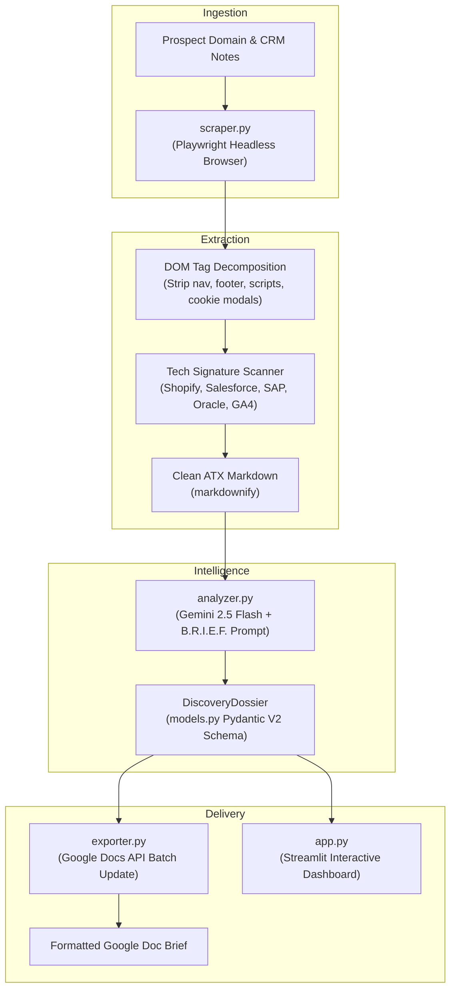
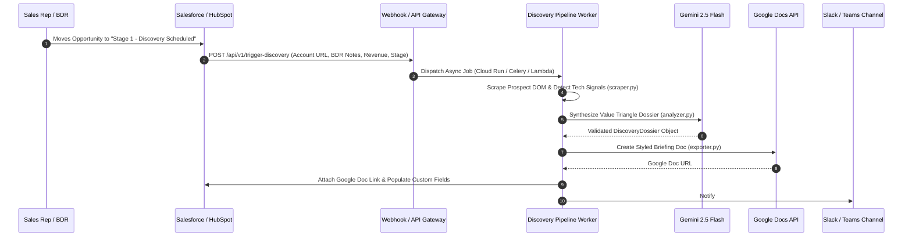

# Retail Pre-Sales Discovery Agent

[](https://www.python.org/downloads/)
[](https://streamlit.io/)
[](https://ai.google.dev/)
[](https://playwright.dev/)
[](https://docs.pydantic.dev/)

An enterprise-grade Pre-Sales Discovery Pipeline engineered for Solution Engineers (SEs) and Account Executives (AEs) selling into Tier-1 and Tier-2 retail enterprises. 

The agent automatically crawls prospect storefronts, isolates architectural signals (e-commerce engines, POS, ERP, OMS, WMS, and analytics footprints), synthesizes retail friction across the **Value Triangle** using **Gemini 2.5 Flash**, and outputs an executive briefing document formatted and published directly to **Google Docs**.

---

## Architecture Overview

The system is decomposed into five decoupled, testable modules:



---

## Enterprise Production Architecture: CRM Webhook Trigger

> [!TIP]
> **Production Recommendation: Event-Driven CRM Automation**
> 
> While the Streamlit interface provides an interactive workbench for ad-hoc research, in a **true enterprise deployment** this pipeline would run as an automated, event-driven service triggered by your CRM:



### Key Benefits of CRM Webhook Integration:
1. **Zero Manual Overhead**: Account research runs automatically the moment a BDR qualifies a lead or books an introductory discovery call.
2. **Standardized Deal Preparation**: Every Solution Engineer and Account Executive receives an identical, high-quality briefing doc attached directly to the Salesforce/HubSpot Opportunity record.
3. **Real-time Deal Alerts**: Team notifications with direct links to the Google Doc brief in the deal Slack channel before the initial customer meeting.

---

## Core Modules

### 1. `models.py` — Pydantic V2 Account Intelligence Contracts
Strict schema validation and data serialization for account intelligence:
- **`DiscoveryDossier`**: Primary briefing object consolidating firmographics, scale, executive summary, tech stack, pain points, discovery questions, and engagement strategy.
- **`TechStackIndicators`**: Tracks e-commerce platform, in-store POS, core merchandising ERP, distributed order management (DOM/OMS), warehouse supply chain (WMS), customer analytics, and architectural signals.
- **`ExecutivePainPoints`**: Maps retail friction strictly to the **Value Triangle**:
  - `technical_gap`: Architectural bottleneck (e.g., nightly batch sync between POS and ERP).
  - `operational_friction`: Frontline pain (e.g., phantom inventory, canceled BOPIS orders).
  - `financial_impact`: Quantifiable business consequence (e.g., \$25M margin erosion from emergency clearance markdowns).
  - `affected_executives`: Impacted retail leaders (VP Merchandising, CIO, etc.).
- **`DiscoveryQuestions`**: Persona-specific discovery questions with `what_to_listen_for` cues and the `value_wedge` against legacy monolithic suites.

### 2. `scraper.py` — Playwright Scraper & DOM Cleaner
High-resilience scraping pipeline designed for JavaScript-heavy modern retail storefronts:
- **DOM Decomposition**: Completely strips non-content elements (`<nav>`, `<footer>`, `<script>`, `<style>`, `<noscript>`, `<svg>`, `<aside>`, `<iframe>`, forms, buttons, inputs, dialogs) and cookie/consent banners (`onetrust`, `gdpr`, `cookie-banner`).
- **Tech Footprint Detection**: Scans script and stylesheet sources prior to DOM decomposition to identify platforms like Shopify Plus, Salesforce Commerce Cloud, SAP Commerce, Oracle Retail, Magento, Segment, Klaviyo, and Bloomreach.
- **Clean Markdown Conversion**: Utilizes `markdownify` with ATX heading styles (`#`, `##`), collapsing whitespace and formatting headers cleanly for optimal token usage.
- **Automatic HTTP Fallback**: Seamlessly falls back to an HTTP session with retries if headless browser execution is unavailable.

### 3. `analyzer.py` — Gemini 2.5 Flash B.R.I.E.F. Engine
Coordinates structured AI synthesis using the official `google-genai` SDK:
- **Model**: `gemini-2.5-flash` with low temperature (`0.2`).
- **Structured Output**: `config=types.GenerateContentConfig(response_mime_type="application/json", response_schema=DiscoveryDossier)` ensuring 100% schema adherence.
- **B.R.I.E.F. Methodology**:
  - **B - Baseline**: Firmographics, market positioning, and existing tech footprint.
  - **R - Retail Gaps**: Architectural friction points across POS-to-ERP latency, unified inventory, allocation, and store ops.
  - **I - Impact**: Value Triangle quantification (Technical Gap $\rightarrow$ Operational Friction $\rightarrow$ Financial Impact).
  - **E - Engagement Questions**: Executive questions per persona with target listening cues.
  - **F - Forward Strategy**: Tactical pre-sales positioning and entry wedge.
- **Enterprise SSL Resilience**: Automatically integrates `truststore` to resolve native Windows/macOS certificate stores, with auto-retry on corporate proxy SSL inspection.

### 4. `exporter.py` — Google Docs API Exporter
Builds and styles an executive pre-discovery briefing in Google Docs:
- Uses `GoogleDocsBriefBuilder` to track character offsets and generate batchUpdate requests for `TITLE`, `SUBTITLE`, `HEADING_1`, `HEADING_2`, bolding, and custom navy/slate palette colors.
- Supports Service Account credentials, OAuth user tokens, or Google Application Default Credentials (ADC).
- Includes `export_dossier_to_markdown` for immediate local download if Google Docs credentials are not configured.

### 5. `app.py` — Streamlit Discovery Studio
Interactive web UI providing:
- **Preset Scenarios**: Quick-load demonstration scenarios for Target, Nordstrom, Williams-Sonoma, or blank canvas.
- **Live Pipeline Feedback**: `st.status` widget updating step-by-step through DOM scraping, tech detection, Gemini 2.5 Flash synthesis, and Google Docs export.
- **Direct Link Button**: One-click action button opening the created Google Doc directly (`Open Formatted Google Doc Brief ↗`).
- **6-Tab Dossier Viewer**: Executive Overview, Tech Stack, Value Triangle Pain Points, Persona Questions, Recommended Strategy, and Raw Scraped Signals.

---

## Getting Started

### 1. Prerequisites
- **Python 3.11+** installed
- **Google Gemini API Key** ([Get one here](https://aistudio.google.com/))
- *(Optional)* **Google Cloud Service Account** with Google Docs and Google Drive API enabled

### 2. Installation

Clone the repository and initialize a virtual environment:

```bash
# Clone repo
git clone https://github.com/mmxco/retail-discovery-agent.git
cd retail-discovery-agent

# Create virtual environment
python -m venv .venv

# Activate virtual environment
# Windows (PowerShell):
.venv\Scripts\Activate.ps1
# macOS / Linux:
source .venv/bin/activate

# Install dependencies
pip install -r requirements.txt

# Install Playwright browser binaries
playwright install chromium
```

### 3. Environment Configuration

Create a `.env` file or export environment variables:

```bash
export GEMINI_API_KEY="your-gemini-api-key-here"

# (Optional) For automated Google Docs export
export GOOGLE_APPLICATION_CREDENTIALS="path/to/service_account.json"
```

### 4. Run the Dashboard

Launch the Streamlit dashboard:

```bash
# Direct execution:
.venv\Scripts\streamlit run app.py

# Or if environment is already activated:
streamlit run app.py
```

Open your browser to `http://localhost:8501`.

---

## Programmatic Usage

You can also import and use the pipeline directly in your Python code, workflows, or backend APIs:

```python
from scraper import scrape_retail_site
from analyzer import analyze_retail_prospect
from exporter import export_dossier_to_google_doc, export_dossier_to_markdown

# 1. Scrape storefront
scrape_result = scrape_retail_site("https://target.com", prefer_playwright=True)

# 2. Run Gemini 2.5 Flash B.R.I.E.F. synthesis
dossier = analyze_retail_prospect(
    account_name="Target",
    domain="https://target.com",
    scraped_markdown=scrape_result.markdown,
    tech_signals=scrape_result.tech_signals,
    bdr_notes="Regional store allocation friction causing split shipments.",
    api_key="YOUR_GEMINI_API_KEY",
)

# 3. Access structured data contracts
for pain in dossier.pain_points:
    print(f"[{pain.category}] Gap: {pain.technical_gap} -> Impact: {pain.financial_impact}")

# 4. Export to Google Docs or Markdown
doc_info = export_dossier_to_google_doc(dossier)
print(f"Created Google Doc: {doc_info['document_url']}")
```

---

## License

Apache-2.0. See `LICENSE` for details.
