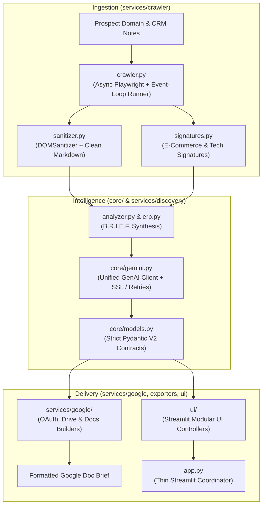
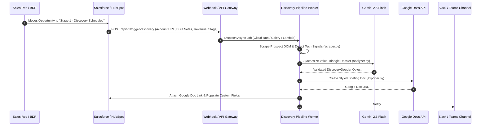

# Retail Pre-Sales Discovery Agent

[](https://www.python.org/downloads/)
[](https://streamlit.io/)
[](https://ai.google.dev/)
[](https://playwright.dev/)
[](https://docs.pydantic.dev/)
[](https://docs.pytest.org/)

An enterprise-grade Pre-Sales Discovery Pipeline engineered for Solution Engineers (SEs) and Account Executives (AEs) selling into Tier-1 and Tier-2 retail enterprises. 

The agent automatically crawls prospect storefronts, isolates architectural signals (e-commerce engines, POS, ERP, OMS, WMS, and analytics footprints), synthesizes retail friction across the **Value Triangle** using **Gemini 2.5 Flash**, and outputs an executive briefing document formatted and published directly to **Google Docs**.

---

## Architecture Overview

The system is decomposed into clean, modular layers adhering to separation of concerns:



---

## Enterprise Production Architecture: CRM Webhook Trigger

> [!TIP]
> **Production Recommendation: Event-Driven CRM Automation**
> 
> While the Streamlit interface provides an interactive workbench for ad-hoc research, in a **true enterprise deployment** this pipeline would run as an automated, event-driven service triggered by your CRM:



### Key Benefits of CRM Webhook Integration:
1. **Zero Manual Overhead**: Account research runs automatically the moment a BDR qualifies a lead or books an introductory discovery call.
2. **Standardized Deal Preparation**: Every Solution Engineer and Account Executive receives an identical, high-quality briefing doc attached directly to the Salesforce/HubSpot Opportunity record.
3. **Real-time Deal Alerts**: Team notifications with direct links to the Google Doc brief in the deal Slack channel before the initial customer meeting.

---

## Directory Structure

```
retail-discovery-agent/
│
├── core/                              # Central system kernel & data contracts
│   ├── config.py                      # Central configuration, timeouts, paths & logging
│   ├── exceptions.py                  # Standardized exception hierarchy
│   ├── gemini.py                      # Shared GenAI client (SSL fallback, backoff, schemas)
│   └── models.py                      # Single source of truth for all Pydantic V2 schemas
│
├── services/                          # Decoupled domain service engines
│   ├── crawler/
│   │   ├── crawler.py                 # Async Playwright crawler with thread-pool runner
│   │   ├── sanitizer.py               # Unified DOMSanitizer & markdown conversion
│   │   └── signatures.py              # Retail tech footprint detection patterns
│   │
│   ├── discovery/
│   │   ├── analyzer.py                # Prospect analysis & B.R.I.E.F. synthesis
│   │   ├── erp.py                     # Legacy ERP & inventory sync specialist
│   │   └── pipeline.py                # High-level discovery pipeline orchestrator
│   │
│   └── google/
│       ├── oauth.py                   # Local OAuth server & credential lifecycle
│       ├── drive.py                   # Drive folder CRUD & error diagnostics
│       └── docs.py                    # Google Docs briefing document builder
│
├── auth/                              # Authentication interfaces
│   └── google_oauth.py                # Backward-compatible OAuth adapter
│
├── integrations/                      # Cloud integrations
│   └── drive_service.py               # Drive service client adapter
│
├── exporters/                         # Document & report exporters
│   ├── gdocs_exporter.py              # Google Docs batchUpdate export engine
│   └── markdown_exporter.py           # ATX Markdown export engine
│
├── ui/                                # Modular Streamlit UI components
│   ├── sidebar.py                     # Auth, API keys & environment panel
│   ├── form.py                        # Account inputs, scenario presets & profile save/load
│   └── tabs.py                        # Modular dossier tab views & metrics renderers
│
├── tests/                             # Comprehensive automated test suite (70 tests)
│   ├── conftest.py                    # Pytest fixtures and mock factories
│   ├── test_analyzer.py               # Discovery & B.R.I.E.F. synthesis tests
│   ├── test_crawler.py                # Crawler & DOM sanitizer unit tests
│   ├── test_drive.py                  # Drive API integration tests
│   ├── test_exporters.py              # Google Docs & Markdown export tests
│   ├── test_gemini.py                 # Unified GenAI client & retry tests
│   ├── test_legacy_erp.py             # ERP extraction & schema validation tests
│   ├── test_models.py                 # Pydantic V2 contract integrity tests
│   ├── test_oauth.py                  # OAuth credential handling tests
│   ├── test_persistence.py            # Account profile persistence tests
│   └── test_ui.py                     # Streamlit component tests
│
├── app.py                             # Thin Streamlit entry point (178 lines)
├── profile_manager.py                 # Account profile manager interface
├── requirements.txt                   # Production dependencies
└── pytest.ini                         # Pytest configuration
```

---

## Core Modules & Capabilities

### 1. `core/models.py` — Pydantic V2 Account Intelligence Contracts
Strict schema validation and data serialization for account intelligence:
- **`DiscoveryDossier`**: Primary briefing object consolidating firmographics, scale, executive summary, tech stack, pain points, discovery questions, and engagement strategy.
- **`TechStackIndicators`**: Tracks e-commerce platform, in-store POS, core merchandising ERP, distributed order management (DOM/OMS), warehouse supply chain (WMS), customer analytics, and architectural signals.
- **`ExecutivePainPoints`**: Maps retail friction strictly to the **Value Triangle**:
  - `technical_gap`: Architectural bottleneck (e.g., nightly batch sync between POS and ERP).
  - `operational_friction`: Frontline pain (e.g., phantom inventory, canceled BOPIS orders).
  - `financial_impact`: Quantifiable business consequence (e.g., \$25M margin erosion from emergency clearance markdowns).
  - `affected_executives`: Impacted retail leaders (VP Merchandising, CIO, etc.).
- **`DiscoveryQuestions`**: Persona-specific discovery questions with `what_to_listen_for` cues and the `value_wedge` against legacy monolithic suites.

### 2. `core/gemini.py` — Unified LLM Client Service
- Centralized `GeminiClient` wrapping the official `google-genai` SDK.
- Handles client instantiation, automatic SSL fallback for enterprise corporate proxies, exponential backoff on `ResourceExhausted` (HTTP 429) rate limits, and schema-constrained structured output generation (`response_schema=...`).

### 3. `services/crawler/` — Async Playwright Scraper & DOM Sanitizer
- **Async Execution**: Pure `async_playwright` implementation backed by a robust `run_async` thread-pool executor for safe invocation from synchronous callers (Streamlit, Celery).
- **DOM Sanitization**: `DOMSanitizer` decomposes non-content elements (`<nav>`, `<footer>`, `<script>`, `<style>`, modals, cookie banners) and converts DOM structures into clean ATX Markdown.
- **Tech Footprint Scanner**: Regex-based detection matching signatures across Shopify Plus, Salesforce Commerce Cloud, SAP Commerce, Oracle Retail, Magento, GA4, Klaviyo, and Bloomreach.

### 4. `services/discovery/` — B.R.I.E.F. Synthesis Engine
Coordinates structured AI synthesis using Gemini 2.5 Flash:
- **B - Baseline**: Firmographics, market positioning, and existing tech footprint.
- **R - Retail Gaps**: Architectural friction points across POS-to-ERP latency, unified inventory, allocation, and store ops.
- **I - Impact**: Value Triangle quantification (Technical Gap $\rightarrow$ Operational Friction $\rightarrow$ Financial Impact).
- **E - Engagement Questions**: Executive questions per persona with target listening cues.
- **F - Forward Strategy**: Tactical pre-sales positioning and entry wedge.

### 5. `services/google/` & Exporters
- **Google Docs API Builder**: Character-offset batch updates formatting titles, headings, callouts, tables, and palette colors.
- **Desktop OAuth Flow**: Local web server loop handling developer token authorization and refreshing.
- **Markdown Exporter**: Instant offline export to ATX Markdown files.

### 6. `ui/` & `app.py` — Modular Streamlit UI
- `app.py` serves as a clean 178-line routing coordinator.
- Discrete UI controllers manage sidebar settings (`ui/sidebar.py`), profile form inputs and presets (`ui/form.py`), and 6-tab dossier visualizers (`ui/tabs.py`).

---

## Getting Started

### 1. Prerequisites
- **Python 3.11+** installed
- **Google Gemini API Key** ([Get one here](https://aistudio.google.com/))
- *(Optional)* **Google Cloud Service Account** with Google Docs and Google Drive API enabled

### 2. Installation

Clone the repository and initialize a virtual environment:

```bash
# Clone repo
git clone https://github.com/mmxco/retail-discovery-agent.git
cd retail-discovery-agent

# Create virtual environment
python -m venv .venv

# Activate virtual environment
# Windows (PowerShell):
.venv\Scripts\Activate.ps1
# macOS / Linux:
source .venv/bin/activate

# Install dependencies
pip install -r requirements.txt

# Install Playwright browser binaries
playwright install chromium
```

### 3. Environment Configuration

Create a `.env` file or export environment variables:

```bash
export GEMINI_API_KEY="your-gemini-api-key-here"

# (Optional) For automated Google Docs export
export GOOGLE_APPLICATION_CREDENTIALS="path/to/service_account.json"
```

### 4. Run the Dashboard

Launch the Streamlit dashboard:

```bash
# Direct execution:
.venv\Scripts\streamlit run app.py

# Or if environment is already activated:
streamlit run app.py
```

Open your browser to `http://localhost:8501`.

---

## Automated Test Suite

The repository includes a comprehensive, hermetic test suite with **70 automated tests** covering all modules without requiring live network, external browsers, or active Google credentials:

```bash
# Run all tests
pytest

# Run tests with verbose output
pytest tests/ test_extraction.py -v
```

---

## Programmatic Usage

You can import and use the pipeline directly in your Python code or backend services:

```python
from services.crawler.crawler import scrape_retail_site
from services.discovery.analyzer import analyze_retail_prospect
from exporters.gdocs_exporter import export_dossier_to_google_doc
from exporters.markdown_exporter import export_dossier_to_markdown

# 1. Scrape storefront
scrape_result = scrape_retail_site("https://target.com", prefer_playwright=True)

# 2. Run Gemini 2.5 Flash B.R.I.E.F. synthesis
dossier = analyze_retail_prospect(
    account_name="Target",
    domain="https://target.com",
    scraped_markdown=scrape_result.markdown,
    tech_signals=scrape_result.tech_signals,
    bdr_notes="Regional store allocation friction causing split shipments.",
    api_key="YOUR_GEMINI_API_KEY",
)

# 3. Access structured data contracts
for pain in dossier.pain_points:
    print(f"[{pain.category}] Gap: {pain.technical_gap} -> Impact: {pain.financial_impact}")

# 4. Export to Google Docs or Markdown
doc_info = export_dossier_to_google_doc(dossier)
print(f"Created Google Doc: {doc_info['document_url']}")
```

---

## License

Apache-2.0. See `LICENSE` for details.

